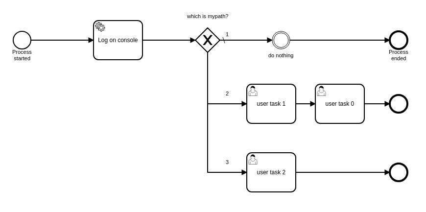
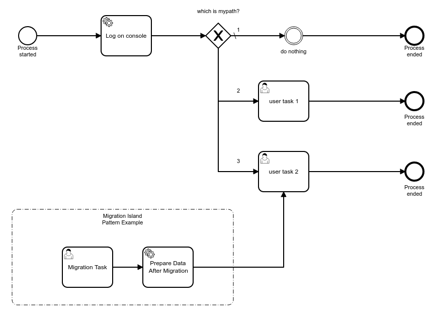
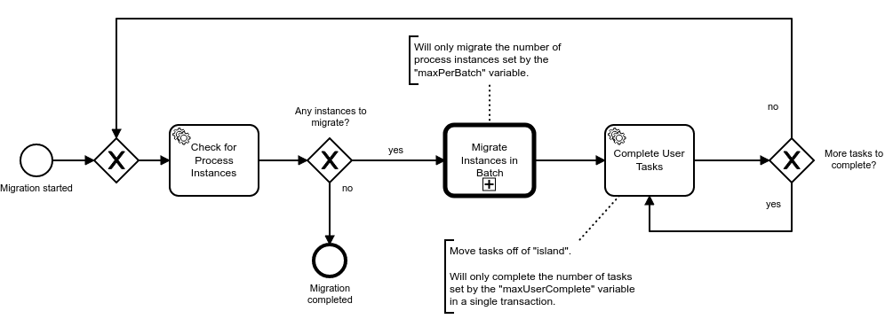
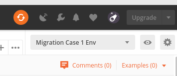
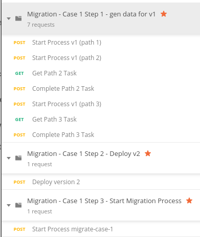
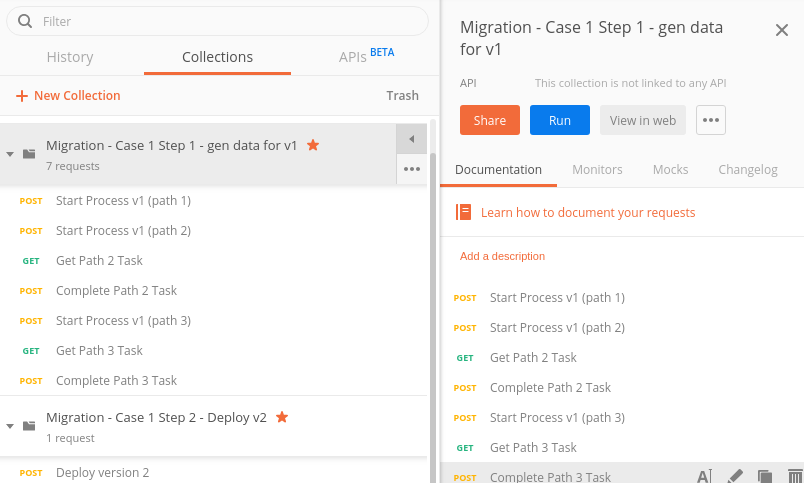
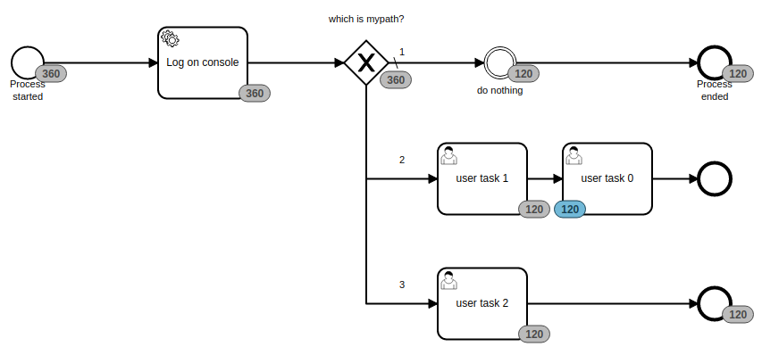
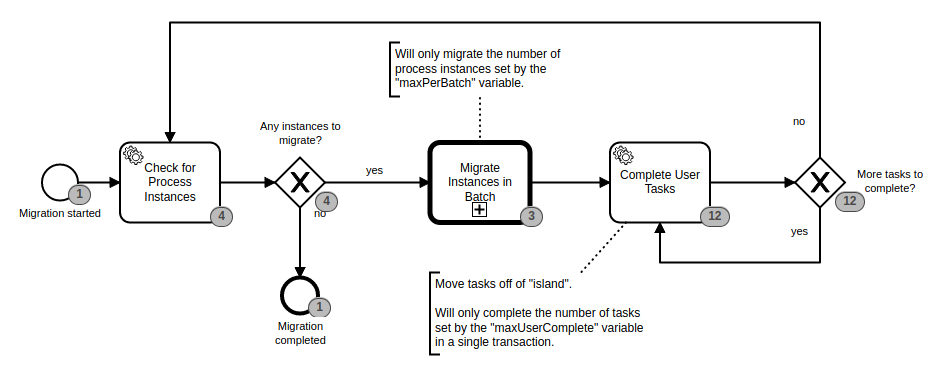
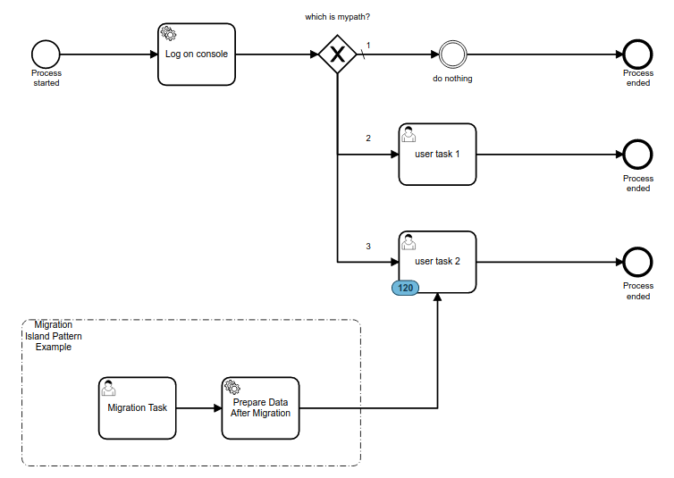

## Use Case 1 - Using a Migration Island with Limited Batch Sizes

In this use case, we have a process that loses a User Task from version 1 to version 2.

**Version 1** looks like this.  Notice on path 2 that there is a "User Task 0".



In **Version 2**, "user task 0" no longer exists, so we need to migrate all existing tokens on "user task 0" to "user task 2" over on path 3.  The problem is that the development team is telling us that if we do this token migration directly then those process instances might not function properly.  Some kind of "data massage" is required in order to make sure that migration from "user task 0" to "user task 2" happens without incident.

(NOTE:  For the purposes of this exercise, the actual data that needs to be prepped for this to work correctly is irrelevant and out of scope.  Let us just pretend that many things needs to be carefully changed for the migration to work correctly)



So the development team decides to use a "Migration Island" pattern for this migration.  They will use the process migration functionality of Camunda to migrate tokens of "user task 0" from v1 to the "Migration Task" user task shown in version 2.  The only purpose of this "island" is to accept tokens during a process migration process.  The process model design should allow no other means to arrive at this island in the flow.

The DevOps team also has a concern during this migration.  They are concerned that there might be over 50,000 instances to migrate on deployment night, and that the migration itself might cause unexpected load on the infrastructure.  Therefore, they are asking the development team to migrate in controlled batches, setting a proper maximum number of process instances to migrate during each batch.  For instance, let us say 500 at a time.

## Use Case 1 - Solution

The development team decides to create a process to handle the migration.



The reusable "Migrate Instances in Batch" subprocess looks like this:


Migration is triggered by creating a process instance of this Migration process using the REST API.  The payload that initializes process instance variables in our local example looks like this:
```json
    {
        "variables": {
            "processDefKey": {
                "value": "use-case-1",
                "type": "String"
            },
            "fromVersion": {
                "value": 1,
                "type": "Integer"
            },
            "toVersion": {
                "value": 2,
                "type": "Integer"
            },
            "fromUserTaskKey": {
                "value": "user-task-0",
                "type": "String"
            },
            "toUserTaskKey": {
                "value": "migration-task",
                "type": "String"
            },
            "maxPerBatch": {
                "value": 50,
                "type": "Integer"
            },
            "maxUserComplete": {
                "value": 10,
                "type": "Integer"
            },
            "skipIoMappings": {
                "value": true,
                "type": "Boolean"
            },
            "skipCustomListeners": {
                "value": true,
                "type": "Boolean"
            }
        }
    }
```


Notice the "maxPerBatch" variable.  In our local example, we will create 120 instances of version 1 with a token sitting on "user task 0".  Then we will run this migration process, instructing it to migrate in batches of 50 at a time.

Also, note the "maxUserComplete" variable.  Here we are saying "complete no more than 10 user tasks in a single transaction".

The migration process will loop for each batch of process instances to migrate.  For each batch, it will:

-   suspend the processes
-   execute the migration
-   activate the processes
-   using the API, complete the User migration task.  This will trigger the "Prepare Data After Migration" service task, and allow the token to rest at it's final destination, the "user task 2" task.

### Steps to execute the solution locally

1.  Start the Spring Boot application.  The application class is CamundaApplication.java.  Use either your IDE, or using maven with:

        mvn spring-boot:run

This will start Camunda BPM, as well as auto-deploy the first version of the process (case1.bpmn).

2.  Open Postman.  Import the following 4 files into Postman.  They are located in the src/test/resources directory:

    

Once the environment file is loaded, make sure it is selected in your Postman IDE:



Once all files are imported, you should see the following three collections:



3.  Notice that the "Step 1" collection for generating the data actually does the following:

    -   Starts a process instance that will go down path 1 after the gateway.  That process will auto-complete.
    -   Starts a process instance that will go down path 2 after the gateway.  It will stop at "user task 1".
    -   Get that task instance and complete it, to push the token to "user task 0".
    -   Starts a process instance that will go down path 3, then push that token all the way to completion.

    This means that every time we run this collection of calls, we will have two completed instances (path 1 and 3), and one incomplete instance with a token sitting at "user task 0".

    We want to run this collection 120 times by using the Collection Runner.  Select the "play" button in the upper right portion of the collection.  It should take you to this interface:

    

Select "Run", then enter "120" for iterations, with a delay of 20 milliseconds.  Run the collection.  When it is complete, log into Cockpit (<http://localhost:8080/app/cockpit/default/>) with demo/demo.  Select the "use-case-1" process definition.  You should see 120 tokens on "user task 0".  If you are running Camunda EE and have History view, it should look like this:



4.  In Postman, go to the "Deploy Version 2" request in the Step 2 collection.  Select the "Body" tab of the request, and reload the file provided for the "data" parameter.  It is the "case1_ver2_template.bpmn" file that is located in the root of the Spring Boot project.  Once complete, select the "Save" button, then the "Run" button.  This should deploy version 2 of the use-case-1 process.  Confirm deployment by going into Cockpit to see both versions.

5.  In Postman, go to the "Start process migrate-case-1" request in the "Case 1 - Step 3" collection.  Run the request to start the migration.  Observe the log in Spring Boot to watch the process navigation.  When complete, go into Cockpit to see the results.

    The migration should have run in three batches (50, 50, 20).  History would show something like this:

    

Migration success would look like this:


